**Задача по созданию модульного теста функции factorize**

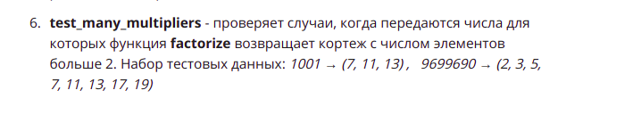
**Создание базовых классов**
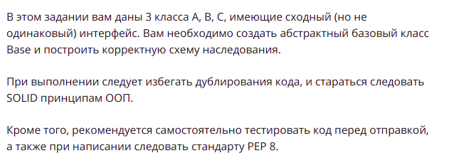
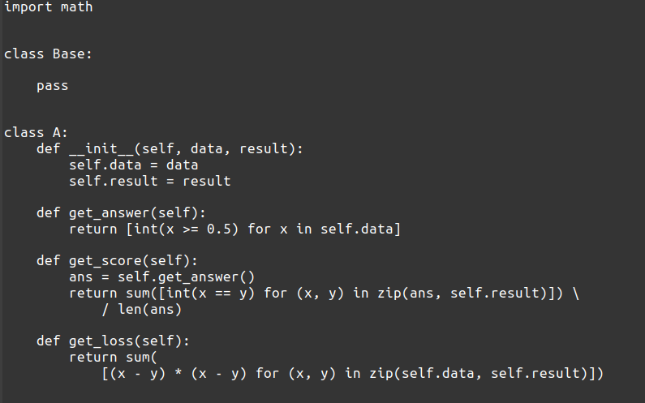
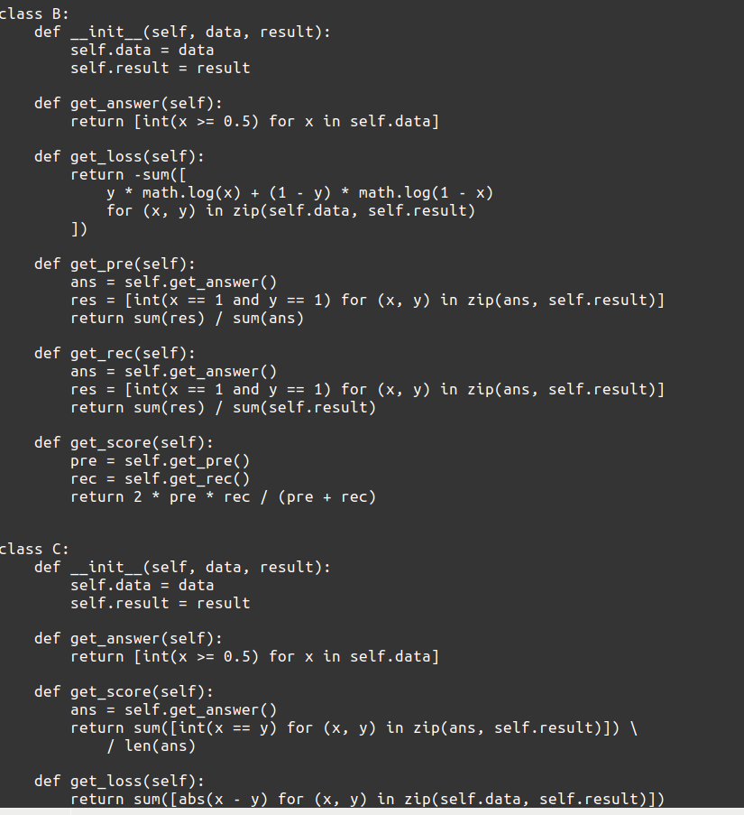
**Создание иерархий классов**
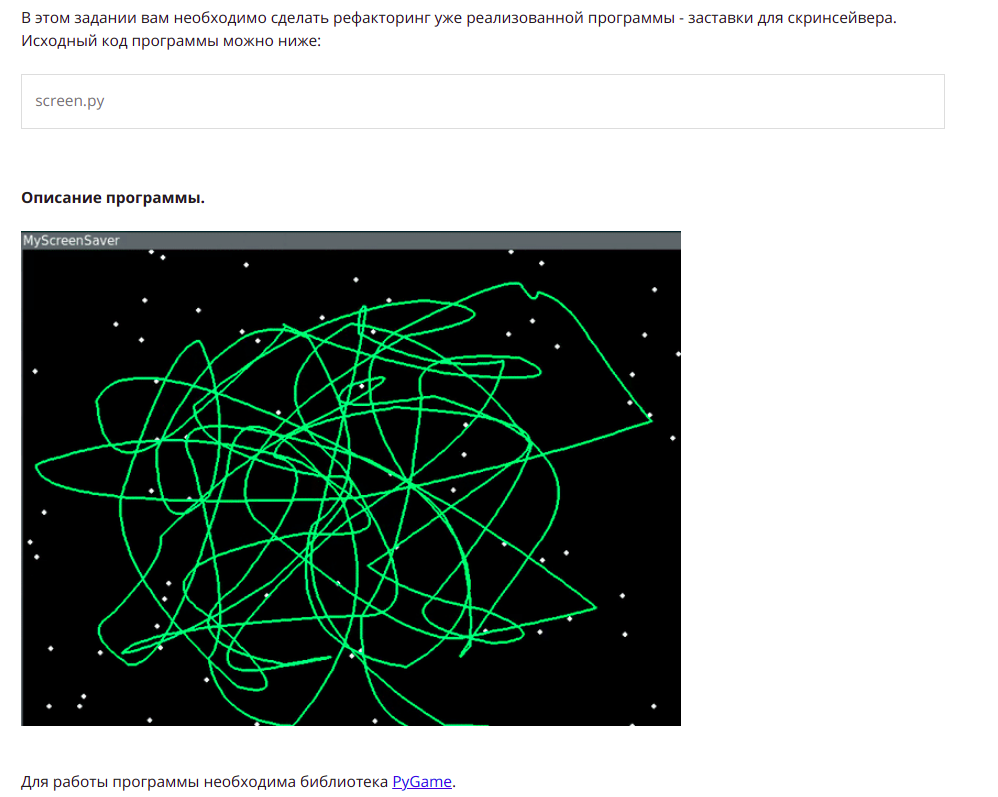
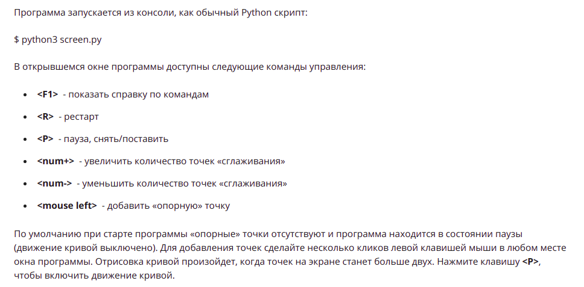

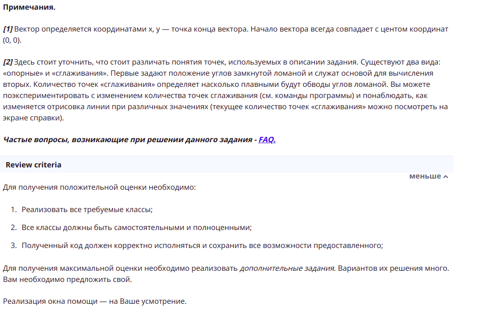
**Создание декоратора класса**
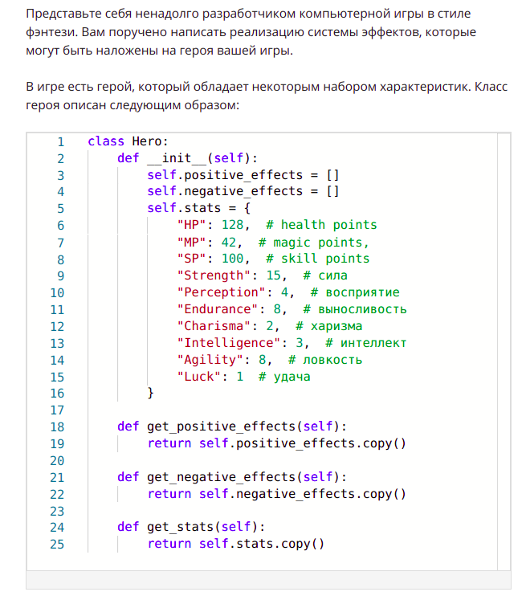
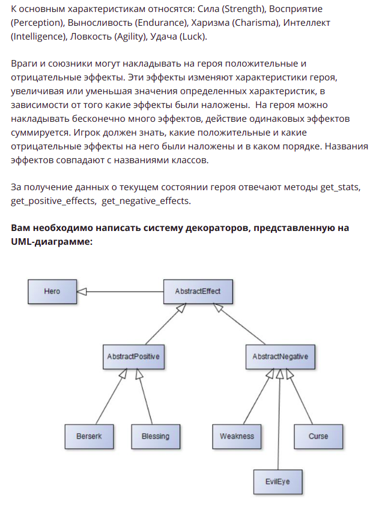
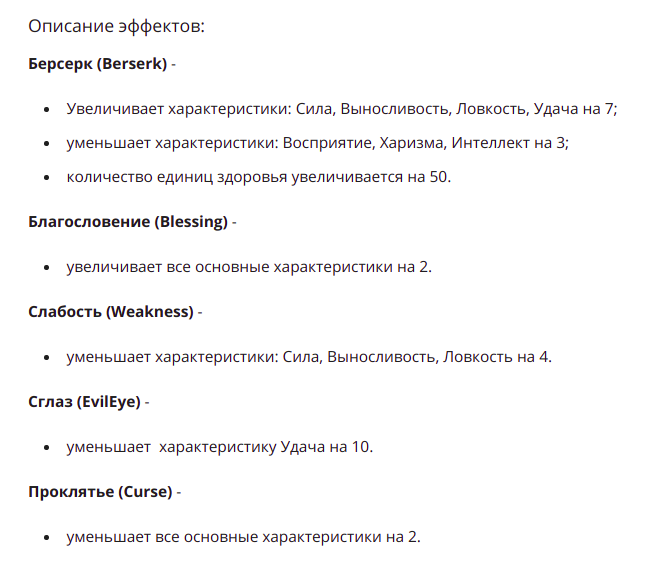
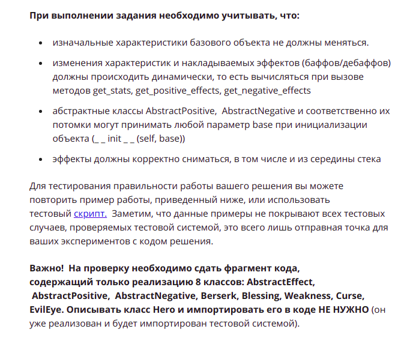
**Паттерн Наблюдатель**
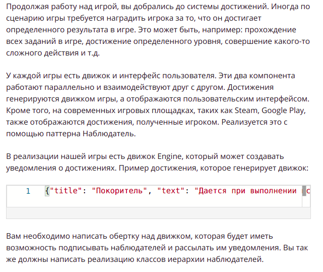
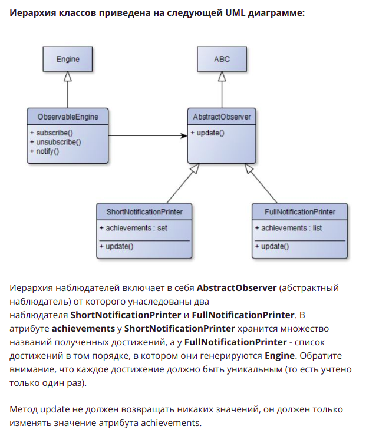
**Реализовать Chain of Responsibility**
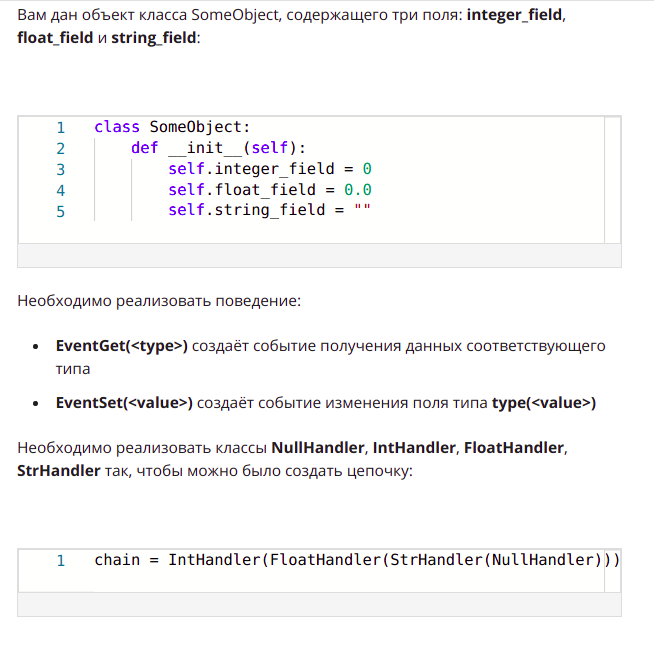
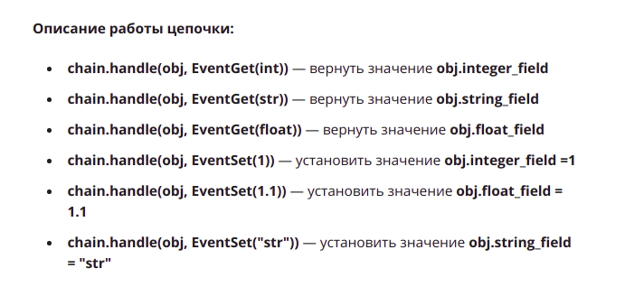
**Реализуйте абстрактную фабрику**
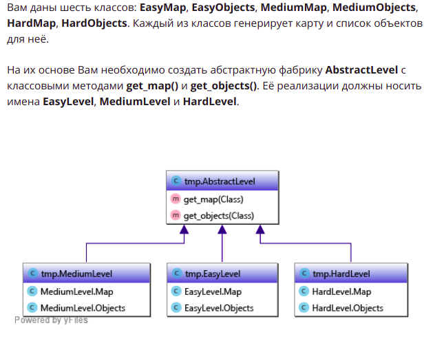
**Игра «Рыцарь в подземелье»**
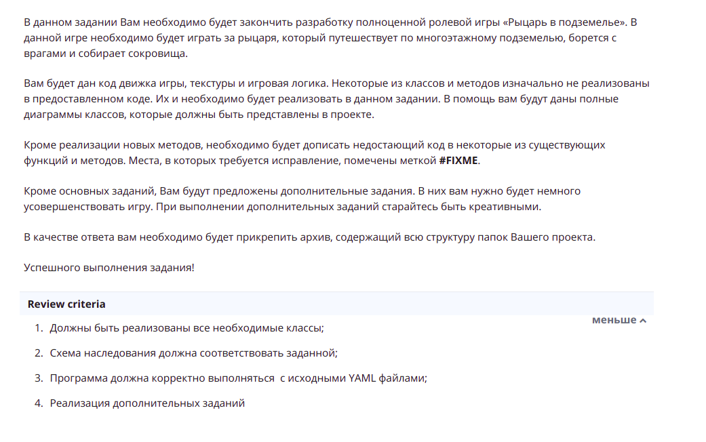
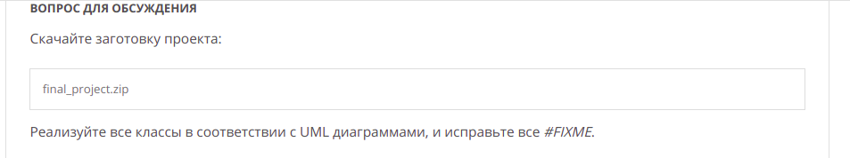

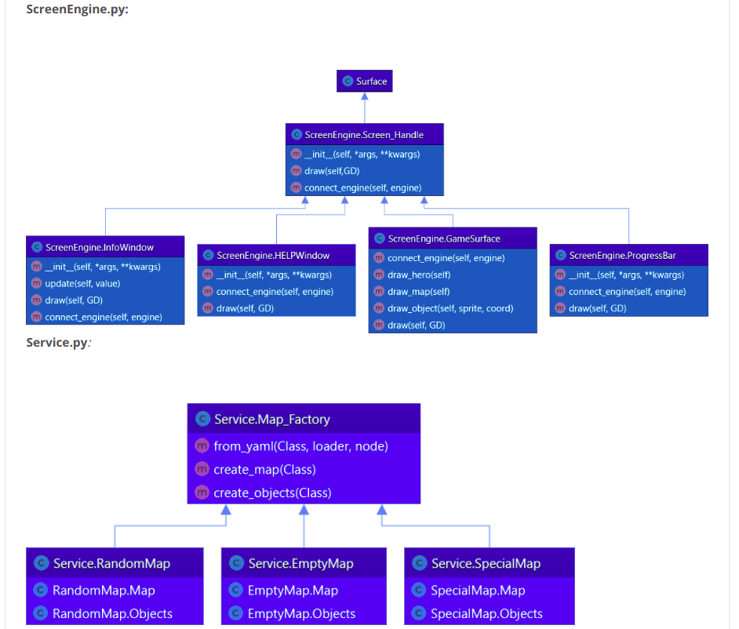