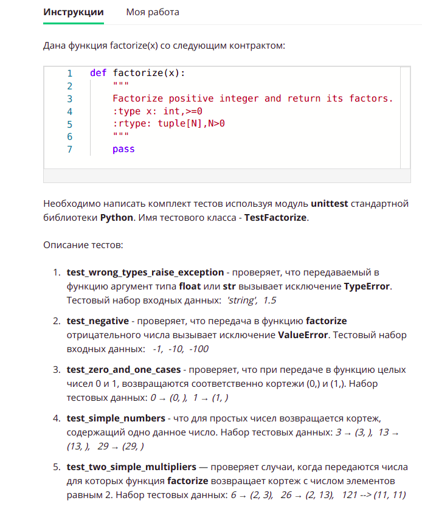
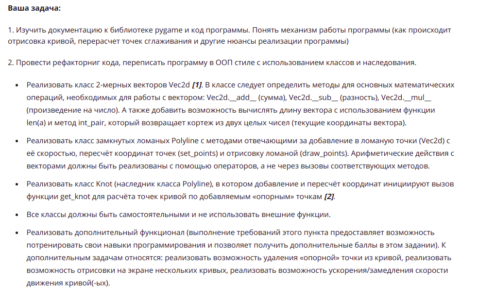
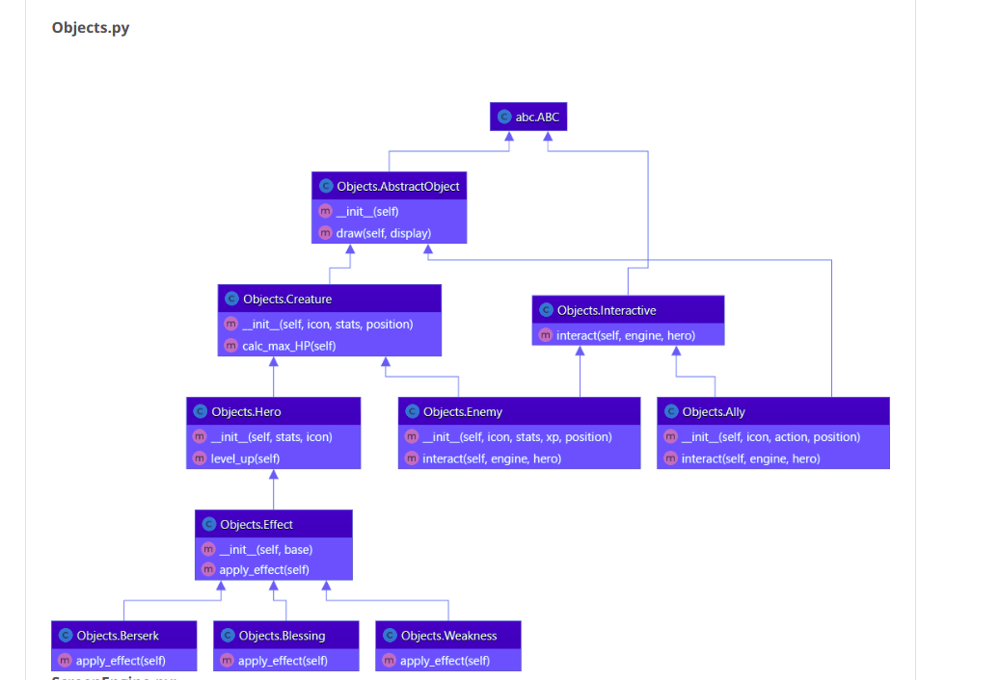

**Задача по созданию модульного теста функции factorize**

**Создание базовых классов**

**Создание иерархий классов**

**Создание декоратора класса**

**Паттерн Наблюдатель**

**Реализовать Chain of Responsibility**

**Реализуйте абстрактную фабрику**

**Игра «Рыцарь в подземелье»**

